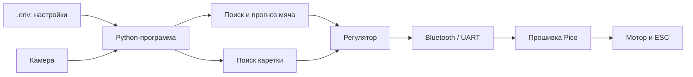

# Код и алгоритмы Wasserschwein: подробный разбор

Это справочник по **активному коду** проекта. Он объясняет каждую собственную
функцию: что она получает, что делает, зачем нужна и чем её можно заменить.
Код сторонних библиотек — OpenCV, NumPy, PySerial, Pico SDK и YOLO — не
переписывается: здесь описано, как проект ими пользуется.

Документ написан для чтения вместе с [общим руководством](PROJECT_GUIDE_RU.md).
Там — порядок запуска, а здесь — устройство программы.

## 1. Карта системы



В проекте нет обязательной нейросети для управления. Основная цепочка основана
на цвете, геометрии и простой физической модели:

```text
кадр → HSV-маска → круглый объект → фильтр Калмана → прогноз → команда PWM
```

## 2. Важные алгоритмы до разбора функций

### 2.1 Поиск по цвету HSV

**Зачем.** Камера отдаёт миллионы пикселей. HSV-маска быстро оставляет только
те, которые похожи на цвет мяча или цветной метки каретки.

**Как работает.** Кадр переводится из BGR в HSV, затем `cv2.inRange` создаёт
чёрно-белую маску. Белый пиксель находится между `BALL_HSV_LOWER` и
`BALL_HSV_UPPER` из `.env`.

**Плюсы.** Очень быстро, понятно, не нужны фотографии для обучения.

**Минусы.** Блики, другой предмет такого же цвета и изменение освещения могут
дать ложное срабатывание.

**Альтернативы.** Цветовое пространство Lab, вычитание фона, оптический поток
(поиск движения), шаблонный поиск или YOLO (нейросеть). Для данного стенда HSV
предпочтительнее: поле можно сделать контролируемым.

### 2.2 Морфология, контуры и круглость

**Зачем.** После HSV остаются шум и блики. Морфология `OPEN` удаляет мелкие
точки, а `CLOSE` заделывает маленькие разрывы. Затем OpenCV ищет контуры.

Для самого большого контура вычисляется круглость:

```text
круглость = 4 × π × площадь / периметр²
```

У идеального круга она близка к `1`. Длинная полоса или случайное пятно имеют
меньшее значение.

**Альтернативы.** `cv2.HoughCircles` специально для кругов, эллиптическая
аппроксимация, сравнение с шаблоном мяча. Они могут быть полезны, если мяч
плохо выделяется по цвету, но обычно сложнее в настройке.

### 2.3 Гомография: картинка камеры → ровное поле

**Зачем.** Снятое под углом поле имеет перспективу: 10 пикселей внизу кадра и
10 пикселей вверху могут означать разные реальные расстояния. Гомография
(преобразование перспективы) строит «вид сверху» по четырём углам поля.

**Результат.** Программа сначала получает координаты виртуального ровного поля,
а затем масштабирует их в миллиметры. Миллиметры нужны регулятору и понятным
настройкам скорости; само распознавание мяча может работать и без них.

**Альтернативы.** Камера строго перпендикулярно полю с фиксированной высотой —
тогда достаточно простого масштаба. Более точный вариант — калибровка камеры
по шахматной доске плюс учёт искажений объектива. Он полезен для широкоугольной
камеры, но требует больше подготовки.

### 2.4 Фильтр Калмана: оценка текущего движения

**Зачем.** Центр мяча на кадре слегка дрожит из-за шума камеры. Фильтр Калмана
сглаживает измерения и хранит оценку состояния `[x, y, vx, vy]`: положения и
скорости.

**Важно.** Фильтр Калмана здесь не строит полную траекторию до каретки. Он даёт
стартовую позицию и скорость. Дальше отдельный цикл моделирует будущее движение.

**Альтернативы.** Скользящее среднее, медианный фильтр, экспоненциальное
сглаживание, фильтр частиц. Скользящее среднее проще, но хуже оценивает скорость;
фильтр частиц полезен при нескольких сложных гипотезах, но тяжелее вычислительно.

### 2.5 Физический прогноз

**Зачем.** Роботу нужна не текущая точка мяча, а точка, где мяч пересечёт его
линию. Цикл симуляции многократно прибавляет `скорость × время`.

Он учитывает трение, настроенный изгиб, отражение от левой и правой стен и
коэффициент упругости. При пересечении линии каретки вычисляется точка между
двумя шагами, а не просто ближайший шаг.

**Альтернативы.** Прямая линия без физики, аналитическая формула отражений,
обученная модель траектории. Прямая линия проще, но плохо работает после отскока;
нейросеть требует большого набора реальных записей. Текущая симуляция — разумный
компромисс для небольшого поля.

### 2.6 Регулятор движения и PWM

**Зачем.** Нельзя отправлять мотору полную мощность при любой ошибке: каретка
будет дёргаться и пролетать цель. Регулятор ограничивает скорость и ускорение,
затем переводит скорость в PWM (долю мощности мотора 0–255).

**Альтернативы.** Простое правило «далеко — полный газ», PID-регулятор
(пропорционально-интегрально-дифференциальный), профиль движения по времени.
Текущий вариант хорошо подходит как безопасная база. PID станет полезен после
измерения настоящей скорости каретки датчиком положения.

### 2.7 Watchdog: независимая защита связи

**Зачем.** Python или Bluetooth могут зависнуть. Pico не должен оставлять
последнюю команду мотора активной.

Прошивка запоминает время последней корректной команды. Если прошло больше
`PICO_COMMAND_TIMEOUT_MS`, она вызывает торможение независимо от компьютера.

**Альтернативы.** Аппаратное реле безопасности, отдельная физическая кнопка,
аппаратный watchdog микроконтроллера. Их стоит добавить для ещё более опасной
механики; программный watchdog уже является важной базовой страховкой.

## 3. `vision/main.py` — главный сценарий

Этот файл соединяет все части. Он не содержит сам алгоритм поиска мяча — он
открывает устройства, передаёт кадры алгоритмам и обеспечивает безопасное
завершение.

| Функция | Что делает и зачем | Альтернатива / замечание |
| --- | --- | --- |
| `calibration_path(filename)` | Возвращает путь в `vision/calibration/`. Благодаря этому запуск не зависит от текущей папки терминала. | Можно передавать все пути через объект конфигурации; для маленького проекта текущий помощник проще. |
| `configure_camera(camera_id, camera_params)` | Открывает камеру, задаёт размер, FPS и маленький буфер. Малый буфер важен: робот должен видеть свежий кадр, а не старое видео. | GStreamer или отдельный поток захвата уменьшают задержку на сложных камерах. |
| `geometry_matches_frame(frame)` | Сверяет размер кадра с размером, сохранённым во время калибровки. Не даёт применить геометрию от другой камеры или разрешения. | Можно автоматически пересчитать геометрию по ArUco-маркерам. |
| `send_stop(serial_port)` | Посылает `S\n`. Используется при любой аварийной ситуации и в `finally`. | Аппаратное отключение драйвера — дополнительная независимая защита. |
| `send_command(serial_port, direction, pwm)` | Отправляет рабочую команду `F/B число`. Возвращает успех, чтобы не считать неотправленную команду отправленной. | Очередь команд в отдельном потоке нужна, если связь станет сложнее. |
| `main()` | Загружает `.env`, запускает калибровку, создаёт трекеры, читает кадры, вызывает прогноз, регулирует каретку и закрывает ресурсы. | Для более лёгких тестов стоит вынести обработку одного кадра в функцию `process_frame(frame, now)`. |

Ключевая логика безопасности в `main()` такова: если `target_mm` мяча **или**
`robot_mm` равны `None`, регулятор сбрасывается и отправляется `S`. Иначе
команда повторяется через `COMMAND_RESEND_INTERVAL_S`, чтобы watchdog Pico
видел живую связь.

## 4. `vision/config.py` — единая конфигурация

Файл читает `.env` без внешнего пакета. `Config` — не алгоритм зрения, а
граница между кодом и настройками стенда.

| Функция / метод | Что делает и зачем | Альтернатива / замечание |
| --- | --- | --- |
| `load_env_file(env_path)` | Читает строки `KEY=VALUE`, пропускает комментарии. Нужен и Python-части, и пониманию локального `.env`. | `python-dotenv` умеет сложный синтаксис; текущий разбор легче контролировать. |
| `set_env_value(env_path, key, value)` | Меняет одно значение, сохраняя остальные комментарии. Используется после настройки цвета мяча. | TOML/YAML удобнее для вложенных структур, но `.env` проще для начинающего пользователя. |
| `Config.__init__(env_path)` | Выбирает корневой `.env`, проверяет его существование и загружает значения. | Pydantic даёт строгую валидацию, но добавляет зависимость. |
| `_get(key)` | Возвращает обязательное значение или понятную ошибку. | Возврат `None` скрывал бы ошибку настройки. |
| `_get_int(key)` | Преобразует значение в целое число. | — |
| `_get_float(key)` | Преобразует значение в дробное число. | — |
| `_get_hsv(key)` | Преобразует `H,S,V` в массив NumPy и проверяет количество/диапазон чисел. | Отдельный JSON-массив; текущая строка удобна для `.env`. |
| `get_camera_id()` | Возвращает номер камеры. | Автоматический поиск камеры возможен, но может выбрать не ту при нескольких устройствах. |
| `get_camera_params()` | Возвращает ширину, высоту и FPS камеры. | — |
| `get_bluetooth_params()` | Возвращает путь порта, скорость и период повторной отправки команды. | Можно хранить эти данные в отдельном профиле оборудования, но единый `.env` проще. |
| `get_ball_color_bounds()` | Возвращает HSV-границы мяча. | Автоматическая адаптация цвета возможна, но менее предсказуема. |
| `set_ball_color_bounds(lower, upper)` | Сохраняет выбранный оператором цвет мяча в `.env`. | Сохранять профиль калибровки отдельным файлом; текущий вариант быстрее для одного стенда. |
| `get_robot_color_bounds()` | Возвращает HSV-границы цветной метки каретки. | Можно добавить такой же графический калибратор, как для мяча. |
| `get_field_params()` | Возвращает реальные и виртуальные размеры поля для масштабирования. | Работать только в виртуальных координатах можно, но параметры движения станут менее наглядными. |
| `get_physics_params()` | Возвращает трение, упругость и изгиб для прогноза. | Табличная модель по записанным ударам или обученная модель. |
| `get_ball_tracker_params()` | Возвращает все пороги поиска и прогноза мяча. | Жёстко записать значения в код — хуже для настройки стенда. |
| `get_robot_tracker_params()` | Возвращает параметры поиска метки робота. | — |
| `get_controller_params()` | Возвращает пределы скорости, ускорения, PWM и мёртвую зону. | Профили «тест/игра» можно хранить в нескольких `.env`-файлах. |
| `get_safety_params()` | Возвращает время допустимой потери мяча. | Можно добавить отдельный порог уверенности, а не только время. |
| `get_ml_params()` | Возвращает параметры необязательных экспериментов YOLO. | Вынести ML в отдельный конфигурационный файл, если эксперименты станут самостоятельным проектом. |

## 5. `vision/ball_tracker.py` — поиск и прогноз мяча

`BallTracker` — центральный класс компьютерного зрения. Он получает один кадр
и возвращает цель для каретки в миллиметрах и точки траектории для отладочного
окна.

| Функция / метод | Что делает и зачем | Альтернатива / замечание |
| --- | --- | --- |
| `__init__(...)` | Загружает гомографию, стены, линию каретки, HSV, параметры фильтра Калмана и физики. Одно место инициализации исключает скрытые константы. | Передавать один объект конфигурации короче, но явные аргументы лучше показывают зависимости. |
| `set_dt(dt)` | Ограничивает время между кадрами 5–50 мс и меняет матрицу перехода фильтра Калмана. Это защищает от зависшей камеры и нестабильного FPS. | Фиксированный FPS проще, но даёт неправильную скорость при пропусках кадров. |
| `_px_to_mm(pts_px)` | Применяет гомографию и масштаб: координаты камеры превращаются в координаты поля. | Работать в координатах выровненного поля без мм; сырые пиксели использовать не стоит. |
| `_mm_to_px(pts_mm)` | Делает обратное преобразование, чтобы нарисовать прогноз поверх исходного кадра. На управление не влияет. | Показывать отдельное окно «вид сверху». |
| `_detect_ball(frame)` | Выполняет HSV-маску, морфологию, поиск контура, проверку радиуса, площади и круглости; возвращает центр мяча или `None`. | Оценивать всех кандидатов по расстоянию до прошлого мяча — это будущая полезная доработка. |
| `has_fresh_detection(now)` | Проверяет, не устарело ли последнее настоящее обнаружение. | Можно хранить также численную уверенность каждого кадра. |
| `reset_tracking()` | Очищает фильтр Калмана и историю после долгой потери мяча. Не позволяет старому прогнозу стать целью. | Мягко снижать доверие вместо мгновенного сброса; это менее безопасно. |
| `_reflect_from_walls(pos_mm, vel_mm)` | Отражает мяч от левой/правой стены и уменьшает скорость по `BALL_RESTITUTION`. | Геометрическое пересечение с настоящими сегментами стен точнее, если стены не вертикальны на карте. |
| `get_prediction(frame, now)` | Главная функция: ищет мяч, обновляет фильтр, переводит позицию в мм, моделирует будущее движение и возвращает точку пересечения с линией каретки. | Можно заменить аналитической формулой без цикла; текущая пошаговая модель проще расширяется трением и нестандартной физикой. |
| `draw_debug(frame, trajectory_px)` | Рисует зелёное обнаружение и историю, синюю траекторию, красную конечную точку. Очень важна для настройки, но не влияет на команду роботу. | Записывать метрики в файл или показывать веб-панель. |
| `_is_point_in_frame(point, frame)` | Не даёт OpenCV рисовать точки за пределами кадра. | Ограничить координаты (`clip`); текущая проверка безопаснее, потому что не создаёт ложную линию на границе. |

### Подробно о `get_prediction`

1. Вызывает `_detect_ball`.
2. Если мяч найден, передаёт измерение фильтру Калмана и обновляет время
   настоящего обнаружения.
3. Если мяч давно не найден, вызывает `reset_tracking()` и возвращает `None`.
4. Берёт из фильтра оценку положения и скорости.
5. Переводит положение в миллиметры.
6. Если мяч почти стоит, возвращает его текущую точку без длинной симуляции.
7. Иначе небольшими шагами моделирует трение, изгиб и отражения.
8. Когда путь пересекает линию каретки, интерполирует точную точку пересечения.
9. Переводит траекторию обратно в пиксели только для рисования.

Текущее приближение `vel_px * scale_mm` годится при умеренной перспективе.
Точнее вычислять скорость из двух соседних положений, уже преобразованных
гомографией в поле. Это одна из наиболее полезных будущих доработок.

## 6. `vision/robot_tracker.py` — положение каретки

| Функция / метод | Что делает и зачем | Альтернатива / замечание |
| --- | --- | --- |
| `RobotTracker.__init__(...)` | Сохраняет HSV метки, гомографию, масштаб и короткую историю точек. | Энкодер на каретке дал бы положение независимо от камеры. |
| `get_position(frame)` | Находит цветную метку тем же HSV-методом, проверяет размер, переводит точку в мм и возвращает медиану последних измерений. Медиана хорошо убирает одиночный выброс. | Фильтр Калмана для каретки даст ещё и скорость; обычное среднее хуже переживает ложную точку. |

## 7. `vision/robot_controller.py` — решение, как ехать

| Функция / метод | Что делает и зачем | Альтернатива / замечание |
| --- | --- | --- |
| `RobotController.__init__(...)` | Сохраняет физические ограничения каретки и внутреннюю командную скорость. | PID с обратной связью от энкодера для более точной механики. |
| `reset()` | Обнуляет накопленную скорость после стопа или потери трекинга. | Без сброса старая скорость может вернуться после краткой потери мяча. |
| `_limit_acceleration(desired_speed_mm_s, dt)` | Не позволяет скорости измениться быстрее разрешённого ускорения. | S-образный профиль ускорения уменьшает рывки ещё сильнее. |
| `_speed_to_pwm(speed_mm_s)` | Нормирует физическую скорость в целое PWM 0–`max_pwm`. | Калибровочная таблица «PWM → реальная скорость» точнее линейной формулы. |
| `update_motion(target_pos_mm, current_pos_mm, dt)` | Считает ошибку, применяет мёртвую зону, ограничение торможения и ускорения; возвращает скорость со знаком и PWM. | PID лучше компенсирует трение, но требует тщательно измеренной обратной связи. |

Формула `sqrt(2 × ускорение × расстояние)` выбирает скорость, при которой
остаётся физическая возможность затормозить до цели. Это безопаснее, чем всегда
ехать на максимальной скорости.

## 8. `vision/color_calibrate.py` — подбор цвета мяча

| Функция / метод | Что делает и зачем | Альтернатива / замечание |
| --- | --- | --- |
| `ColorCalibrator.__init__(camera_id, config, frame_size)` | Открывает камеру и создаёт шесть HSV-ползунков со значениями из `.env`. | Калибровка кликом по мячу может быть удобнее, но требует расчёта статистики цвета. |
| `_read_bounds()` | Считывает шесть ползунков и собирает две HSV-границы. | — |
| `calibrate()` | Показывает исходный кадр, маску и результат; по Enter или S сохраняет диапазон в `.env`. Esc/Q отменяют калибровку. | Автоматическая адаптация к освещению; она менее прозрачна для оператора. |

## 9. `vision/polygon.py` — разметка геометрии

| Функция / метод | Что делает и зачем | Альтернатива / замечание |
| --- | --- | --- |
| `PolygonMarker.__init__(...)` | Готовит камеру, окно и состояние интерактивной разметки. | ArUco-маркеры в углах поля позволяют убрать ручные клики. |
| `_init_camera()` | Открывает камеру и получает первый кадр. | Захват через отдельный поток полезен только при проблемах с задержкой. |
| `_mouse_callback(...)` | Реагирует на клик: добавляет точку и перерисовывает подсказку. | Сенсорный интерфейс или веб-страница для калибровки. |
| `_calculate_homography(src_points)` | По четырём углам строит матрицу перспективного преобразования в виртуальный прямоугольник. | Полная калибровка камеры точнее при заметных искажениях объектива. |
| `mark_zone(...)` | Последовательно собирает клики одной сущности — периметра, стены или линии каретки — и сохраняет `.npy`. | Автоматическое распознавание границ поля. |
| `_draw_final_zone(data)` | Рисует завершённую разметку синим, чтобы оператор увидел ошибку до запуска. | — |
| `run()` | Запускает все этапы: периметр, правая стена, левая стена, линия каретки. | Мастер калибровки с сохранением промежуточного состояния. |
| `_save_metadata()` | Сохраняет размер кадра и размер виртуального поля в `geometry.json`. Это связывает разметку с конкретной камерой. | Хранить также серийный номер камеры и дату калибровки. |
| `main()` | Отдельный запуск разметки с параметрами из `.env`. | Основной запуск `vision.main` вызывает разметку сам, если данных нет. |

## 10. `vision/bluetooth_cli.py` — ручная команда

| Функция | Что делает и зачем | Альтернатива / замечание |
| --- | --- | --- |
| `build_command(command, value)` | Проверяет диапазоны `S`, `F/B` и `L/R`, добавляет перевод строки. Не даёт вручную отправить явно неверный формат. | Формальный двоичный протокол с контрольной суммой надёжнее, но сложнее для диагностики. |
| `send_manual_command(port, baudrate, command, value)` | Открывает порт, отправляет одну команду и выводит ответ Pico. | Постоянная интерактивная консоль удобна для длительной отладки. |
| `main()` | Берёт настройки Bluetooth из `.env` и разбирает аргументы командной строки. | — |

## 11. Утилиты `tools/`

### 11.1 Камера и HSV

| Файл и функция | Что делает и зачем | Альтернатива / замечание |
| --- | --- | --- |
| `camera_index.py: find_cameras(scan_limit)` | Открывает номера камер от 0 до границы и печатает размеры доступных. Нужна, чтобы узнать `CAMERA_ID`. | `v4l2-ctl --list-devices` даёт более системную информацию в Linux. |
| `camera_index.py: main()` | Читает параметр `--limit`, проверяет его и запускает поиск. | — |
| `hsv_tuner.py: on_trackbar_change(_)` | Пустой обработчик, требуемый OpenCV для ползунка. Реальная обработка идёт в цикле. | Замыкание или callback с состоянием, но это усложнит маленькую утилиту. |
| `hsv_tuner.py: read_bounds()` | Читает HSV-ползунки. | — |
| `hsv_tuner.py: main()` | Открывает камеру из `.env`, показывает маску и сохраняет цвет по S. Это облегчённая альтернатива полной калибровке. | Использовать `ColorCalibrator` напрямую; отдельная утилита удобнее для эксперимента. |

### 11.2 Генерация настроек Pico

| Файл и функция | Что делает и зачем | Альтернатива / замечание |
| --- | --- | --- |
| `generate_firmware_env.py: load_env_file(env_path)` | Читает `.env` без NumPy/OpenCV, чтобы сборка прошивки не зависела от библиотек зрения. | Общий модуль `vision.config` потребовал бы NumPy на машине сборки. |
| `c_number(value, key, is_float)` | Разрешает только число и превращает его в безопасный литерал C. Защищает от случайной вставки произвольного текста в заголовок. | Полноценный валидатор схемы настроек. |
| `generate_header(env_path, output_path)` | Проверяет обязательные `PICO_*`, создаёт временный `generated_env.h` с `#define`. | CMake может читать настройки сам, но скрипт проще тестировать. |
| `main()` | Принимает `--env` и `--output`, вызывает генератор. | — |

### 11.3 Диагностика GPU и ML-эксперименты

| Файл и функция | Что делает и зачем | Альтернатива / замечание |
| --- | --- | --- |
| `check_gpu.py: main()` | Печатает версию PyTorch и наличие CUDA. Нужна только для YOLO, а не для обычной игры. | `nvidia-smi` проверяет драйвер на уровне ОС. |
| `ml/auto_label.py: auto_label_with_yolo(...)` | Запускает готовую YOLO по картинкам и создаёт черновые подписи мяча. Их обязательно проверять вручную. | Полностью ручная разметка медленнее, но точнее. |
| `ml/auto_label.py: main()` | Берёт модель/уверенность из `.env`, разбирает пути и запускает авторазметку. | — |
| `ml/create_validation_split.py: create_validation_split(...)` | Копирует случайную часть пар «изображение + подпись» из train в val. Validation — честная проверочная выборка, не используемая для обучения. | Стратифицированное разделение лучше при нескольких классах; здесь класс один. |
| `ml/create_validation_split.py: main()` | Читает процент и seed из `.env`/аргументов, запускает разделение. | — |
| `ml/train.py: prepare_dataset(...)` | Создаёт папки YOLO и `dataset.yaml`, при желании копирует изображения в train. | Утилиты Roboflow/CVAT дают графический процесс подготовки. |
| `ml/train.py: train_model(...)` | Запускает обучение YOLO с параметрами `.env`; использует CUDA, если она доступна. | Облачное обучение или другая архитектура детектора. |
| `ml/train.py: main()` | По умолчанию только готовит структуру; обучение начинается только с `--train`, чтобы не запустить тяжёлую задачу случайно. | — |

## 12. `firmware/src/` — прошивка Raspberry Pi Pico

### 12.1 `main.c`: жизненный цикл контроллера

| Функция | Что делает и зачем | Альтернатива / замечание |
| --- | --- | --- |
| `main()` | Инициализирует Pico, останавливает ESC при старте, при необходимости калибрует их, читает кнопку и UART, вызывает watchdog. Это главный бесконечный цикл контроллера. | FreeRTOS и отдельные задачи нужны только при более сложной многозадачности. |
| `callibrate_esc()` | Выполняет последовательность импульсов калибровки ESC. Запускается только если `PICO_CALIBRATE_ESC_ON_BOOT=1`. | Калибровать ESC отдельным временным скетчем безопаснее при первой настройке. Название функции сохранено с исторической опечаткой. |
| `esc_drive()` | Отправляет обоим ESC заранее заданные рабочие импульсы. Вызывается кнопкой Pico. | Управлять ESC командами от компьютера; текущая кнопка удобна как локальное управление. |
| `esc_stop()` | Передаёт минимальные импульсы обоим ESC и выключает LED. | Аппаратное снятие питания ESC — более сильная защита. |
| `config()` | Настраивает GPIO, PWM мотора, PWM ESC, UART, кнопку и LED. Без неё дальнейшие вызовы обращались бы к неготовому оборудованию. | Разделить на `init_motor`, `init_uart`, `init_button` для более крупного проекта. |

### 12.2 `arcanoid.c`: мотор, ESC, кнопка

| Функция | Что делает и зачем | Альтернатива / замечание |
| --- | --- | --- |
| `drive(pwm)` | Ограничивает мощность и задаёт два PWM-канала драйвера так, чтобы каретка ехала в одну из сторон или активно тормозила. | Отдельный H-мост с явными `IN1/IN2` может сделать направление нагляднее. |
| `servo_init(gpio)` | Настраивает PWM-слайс для ESC/сервопривода. Сейчас основная `config()` выполняет аналогичную настройку напрямую. | Либо использовать эту функцию в `config()`, либо удалить дублирование после проверки железа. |
| `esc_set_speed(pulse_us, gpio)` | Ограничивает импульс ESC диапазоном и переводит микросекунды в уровень PWM. | Библиотека сервоприводов; прямой PWM даёт прозрачный контроль. |
| `write_ms(degree, gpio)` | Пустая функция совместимости со старым интерфейсом. На реальное управление сейчас не влияет. | Удалить после подтверждения отсутствия внешних вызовов. |
| `battery_charge(gpio)` | Читает сырое значение АЦП для аккумулятора. Сейчас оно не преобразуется в вольты и не участвует в защите. | Добавить делитель напряжения, формулу вольт и порог отключения. |
| `button_clicked(gpio)` | Проверяет нажатие кнопки с антидребезгом: ждёт 20 мс и отпускания. | Аппаратное подавление дребезга или прерывание GPIO. |
| `constrain(value, min_value, max_value)` | Обрезает число до безопасного диапазона. Нужна, чтобы ошибка команды не дала PWM/ESC выйти за пределы. | Макрос `MIN/MAX`; функция меньше рискует двойным вычислением аргументов. |

### 12.3 `uart.c` и `uart.h`: протокол и безопасность

| Функция | Что делает и зачем | Альтернатива / замечание |
| --- | --- | --- |
| `mark_valid_command()` | Запоминает время последней корректной команды и снимает флаг предыдущей аварийной остановки. | Аппаратный таймер watchdog Pico дополнительно страхует зависание всей прошивки. |
| `reject_command(message)` | Тормозит каретку, отправляет ошибку и чистит буфер. Неверный пакет не может оставить старую скорость. | Просто игнорировать ошибку опаснее. |
| `get_uart_buf()` | Собирает байты UART до `\n`, игнорирует `\r`, обнаруживает переполнение. | Кольцевой буфер полезен при более высоком потоке данных. |
| `print_uart_buf()` | Печатает буфер для ручной отладки. В рабочем цикле сейчас не вызывается. | Логирование с уровнями `DEBUG/INFO`. |
| `parse_value(text, value)` | Разбирает число и запрещает лишние символы. Это защита от команд вроде `F 20abc`. | `sscanf` короче, но сложнее надёжно проверить хвост строки. |
| `parse_uart_buf()` | Распознаёт `S`, `F`, `B`, `L`, `R`, проверяет диапазоны и вызывает мотор/ESC. | Бинарный протокол с CRC снижает риск ошибок в шумной связи, но хуже читается человеком. |
| `uart_safety_watchdog()` | Тормозит мотор, если живых команд нет дольше тайм-аута. | Независимое аппаратное реле безопасности. |
| `clear_buf()` из `uart.h` | Очищает накопленную команду после обработки. | `memset` сократит код; текущий цикл понятен начинающему. |

## 13. Тесты

| Файл и функция | Что проверяет и зачем | Альтернатива / замечание |
| --- | --- | --- |
| `tests/test_robot_controller.py: setUp()` | Перед каждым тестом создаёт одинаковый регулятор. Это изоляция тестов: один тест не портит состояние другого. | Создавать объект внутри каждого теста — больше повторений. |
| `test_deadband_stops_the_robot()` | Проверяет, что рядом с целью PWM равен нулю. | Проверка на реальном моторе всё равно нужна отдельно. |
| `test_acceleration_is_limited()` | Проверяет, что скорость не прыгает выше разрешённого ускорения за один кадр. | Property-based testing проверил бы больше случайных комбинаций. |
| `test_speed_and_pwm_are_capped()` | Проверяет верхние пределы скорости и PWM. | Дополнить отрицательными направлениями и случайными входами. |
| `test_reset_clears_commanded_speed()` | Проверяет, что аварийный сброс не оставляет старую скорость. | — |
| `tests/test_firmware_env.py: test_template_generates_complete_header()` | Генерирует временный C-заголовок из `.env.example` и проверяет ключевые макросы. Не даёт забыть настройку Pico в шаблоне. | Проверять все имена макросов автоматически по списку генератора. |

Следующий полезный уровень — тесты на сохранённых кадрах и видео камеры:
проверять `_detect_ball`, потерю мяча, отскоки и последовательность Bluetooth-
команд без настоящего робота. Полный порядок таких тестов описан в
[PROJECT_GUIDE_RU.md](PROJECT_GUIDE_RU.md).

## 14. Что улучшать в первую очередь

1. Выделить обработку одного кадра из `vision.main` в тестируемую функцию.
2. Добавить набор кадров/видео и автотесты `BallTracker`.
3. Отбрасывать цветные объекты вне полигона поля.
4. Выбирать контур по общей оценке: размер, круглость, близость к прошлой точке.
5. Вычислять скорость после гомографии, а не масштабировать скорость в пикселях.
6. Измерить реальную зависимость PWM → скорость и заменить линейное соответствие таблицей.
7. Добавить энкодер каретки и низковольтную защиту аккумулятора.

Эти улучшения важнее нейросети: они повышают безопасность и повторяемость на
реальном стенде, не усложняя систему без необходимости.
